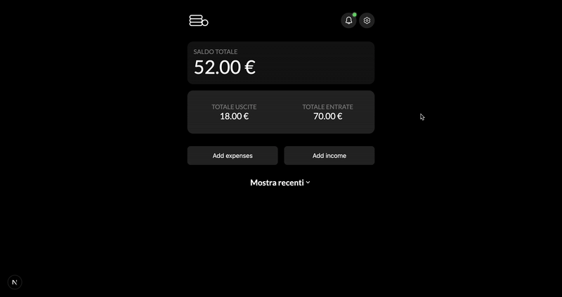

# myWallet

**Simple personal finance tracker**. A small web app built with plain HTML, CSS and JavaScript. It lets the user add income and expenses, stores them in `localStorage`, shows totals and a transaction list, and supports deleting items.

---

## Demo

This is a static web project. You can preview it locally by opening `index.html` in a browser or see it live here: [Live Demo](https://app-mywallet.netlify.app/).

---

## Features

- Add **income** and **expenses** with: date, category and amount.
- Persists transactions in `localStorage`.
- View totals: total income, total expenses and balance.
- Sorts transactions by date (latest first).
- Delete transactions with confirmation dialog.
- Simple client-side internationalization using lang.json and data-key attributes
- Fully responsive UI for desktop and mobile.

---

## Tech stack

- HTML5
- CSS3
- JavaScript
- Browser APIs: `localStorage`, `crypto.randomUUID()`

---

## File structure

```
myWallet/
├─ index.html
├─ style.css
├─ index.js
├─ lang.json
├─ assets/
│  ├─ myWallet.gif
│  ├─ logo.png
│  └─ icons/
└─ README.md


```

---

## Data model

Each transaction object has this shape in memory:

```js
{
  id: "string",        // uuid
  type: "income" | "expenses",
  value: Number,      // float
  category: "string",
  date: "YYYY-MM-DD"
}
```

All transactions are stored as an array in `localStorage` under the `TRANSACTIONS` key.
UI language choice is saved under the key "myWalletLang"

---

## How it works

1. On startup `loadTransactions()` reads `localStorage` and populates the global `TRANSACTIONS` array.
2. `showTransactions()` renders the table (thead + tbody) built from `TRANSACTIONS`. It sorts by date.
3. Clicking **Add income / expenses** shows the relevant form via `showForm()`.
4. When the user submits, `addTransaction(type)` validates inputs, generates an `ID` with `crypto.randomUUID()`, creates a new entry, pushes it to `TRANSACTIONS`, saves it to `localStorage`, updates totals and appends only the new row to the table for performance.
5. To remove an entry, `deleteTransaction(id)` shows a confirmation dialog, then deletes the item form `TRANSACTIONS`, updates storage and totals and removes the corresponding `<tr>`.

---

## Usage

- Click **Add income** or **Add expenses** to open a form.
- Fill date, select category, type amount.
- Click **Add new** to store the transaction.
- Open **Show recent** to toggle the transactions table.
- Click the trash icon to delete a transaction (a confirmation dialog appears).

---

## Future improvements

- Add a feature to sort transactions by date, amount, category, or type.
- ✔️ Add multi-language support (EN | IT)
- Refactor the project using a front-end framework (maybe Astro or React) for better scalability.
- Integrate a backend with Node.js, Express and MySQL.

---

Developed by <a href="https://github.com/simonegarofalo">simonegarofalo</a>

Feel free to fork, use, or contribute to the project.
